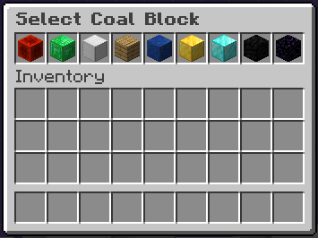
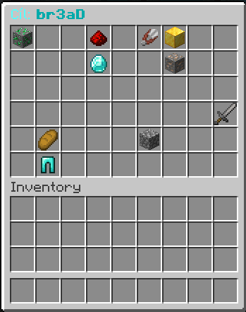

# Two Minecraft Servers Auto-Register POC

This folder contains two standalone proof-of-concept scripts:

- `survival-games.cz.js`
- `darkup.cz.js`

## What It Does

Both scripts automate the same general flow:

- connect to the server
- wait for the registration or menu prompt
- select the expected option from the available items

**Important:** These scripts only handle the **registration/authentication** process.

## How Each Server Works

### Survival-Games.cz
The server opens a registration menu with a scrambled block name in the title. For example, the title might say `"Diamond"` but the actual item in the inventory is named `"diamond_block"`. The player must identify which block matches the title and click it.

**Bypass:** Simple dictionary mapping. We map the title to the correct Minecraft item and click it.



### Darkup.cz
This server uses a more advanced anti-bot system with multiple layers of obfuscation. The registration menu displays a scrambled word using **leet speak** (e.g., `"D14M0ND BL0CK"` instead of `"DIAMOND BLOCK"`), randomly adds prefix words like `"Klikni"`, `"Potřebujeme"`, or `"Cíl"`, and includes special characters (`!`) to confuse parsers. To make it even harder, the item names in the inventory are completely different from what the title suggests. For example:
- The title says `"3ND3R5T0N3"` but the item is `"end_stone"`

**Bypass:** 
String similarity with leet speak normalization. We clean the title by removing color codes, special characters, and the random prefix word, then normalize leet speak and use a similarity algorithm to find the best match.





## Setup

```bash
# Clone the repository
git clone https://github.com/Jyrycek/sg-darkup-auto-register.git
cd minecraft-register-bypass-poc
```

```bash
npm install
```

## Run

Run the scripts directly from the repo root:

```bash
# Survival-Games.cz
node sg-darkup-auto-register/survival-games.cz.js

# Darkup
node sg-darkup-auto-register/darkup.cz.js
```

## Example Output

```text
[NICKNAME] Initializing bot...
[NICKNAME] Connected to server
[NICKNAME] Darkup window opened: ""§bCíl: §3§lir0n iNGot§b""
[NICKNAME] Target word: "ir0n iNGot"
[NICKNAME] Normalized target: "iron ingot"
[NICKNAME] Scanning 90 slots for best match...
[NICKNAME] Item "Chest" similarity: 0.0%
[NICKNAME] Item "Gold Ingot" similarity: 37.5%
[NICKNAME] Item "Stone" similarity: 16.7%
[NICKNAME] Item "Block of Diamond" similarity: 9.5%
[NICKNAME] Item "Grass Block" similarity: 0.0%
[NICKNAME] Item "Iron Ingot" similarity: 62.5%
[NICKNAME] Item "Book" similarity: 0.0%
[NICKNAME] Item "Block of Emerald" similarity: 0.0%
[NICKNAME] Item "Lava Bucket" similarity: 0.0%
[NICKNAME] Item "Ender Pearl" similarity: 0.0%
[NICKNAME] Best match found: "Iron Ingot" (62.5% match)
[NICKNAME] Clicking on slot 32
[NICKNAME] Authentication successful
Authentication: SUCCESS
```

---

Created as a proof-of-concept in **2024** for educational and research purposes.
